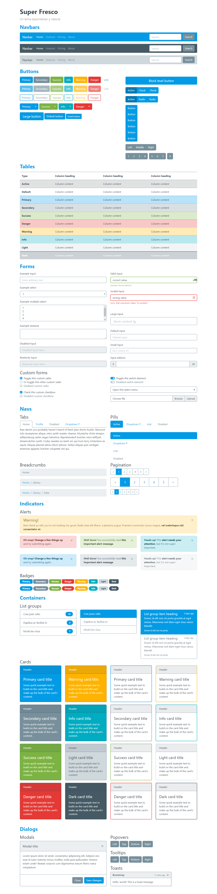

## Super Fresco
Este es el tema personalizado de Bootstrap 4 que utilizo en varios de mis proyectos, lo creé inspirándome en 3 fuentes:

* El tema Cerulean del sitio Bootswatch: https://bootswatch.com/cerulean/
* El sitio web de Freshbooks
* Los colores Material Design 600

Si te gusta y quieres utilizarlo en tus proyectos sigue los siguientes pasos:

### Para compilarlo y usarlo de una vez

#### Paso 1
Asegurate de tener instalado Node.js y en tu terminal ejecuta el siguiente comando:
```
npm install 
```

#### Paso 2
Ejecuta el siguiente comando para compilar todo el proyecto:
```
npm run prod
```
#### Paso 3
En la carpeta que se creó (/dist/css) copia el archivo “super-fresco.min.css” y pégalo en la carpeta de tu proyecto

#### Paso 4
Como este es un tema basado en Bootstrap 4 todavía necesitarás los scripts de Bootstrap, así que no olvides agregarlos en tu archivo HTML
````html
<!doctype html>
<html lang="es">
<head>
    <meta charset="UTF-8">
    <meta name="viewport"
          content="width=device-width, user-scalable=no, initial-scale=1.0, maximum-scale=1.0, minimum-scale=1.0">
    <meta http-equiv="X-UA-Compatible" content="ie=edge">
    <title>Mi página</title>
    <link rel="stylesheet" href="css/super-fresco.css">
</head>
<body>
<!--Scripts para que funcione Bootstrap-->
<script src="https://code.jquery.com/jquery-3.5.1.slim.min.js"></script>
<script src="https://cdn.jsdelivr.net/npm/popper.js@1.16.0/dist/umd/popper.min.js"></script>
<script src="https://stackpath.bootstrapcdn.com/bootstrap/4.5.0/js/bootstrap.min.js"></script>
</body>
</html>
````

### Para modificarlo

#### Paso 1
Asegurate de tener instalado Node.js y en tu terminal ejecuta el siguiente comando:
```
npm install 
```

#### Paso 2
Localiza la carpeta “scss”, ahí encontrarás los estilos del tema para poder modificarlo

* custom (Esta carpeta tiene modificaciones de componentes específicos de Bootstrap)
* _bootstrap-components.scss (Aquí puedes importar todo Bootstrap o solo algunos de sus componentes )
* _vars.scss (En general aquí es donde tendrás que realizar la mayoría de los cambios)
super-fresco.scss

#### Paso 3
Ejecuta el siguiente comando que te abrirá un servidor local donde podrás ver los cambios que haces al momento que modificas el tema
```
npm run dev
```

### Capturas 
Aquí tienes una captura por si tienes curiosidad de ver como es el tema :-)
